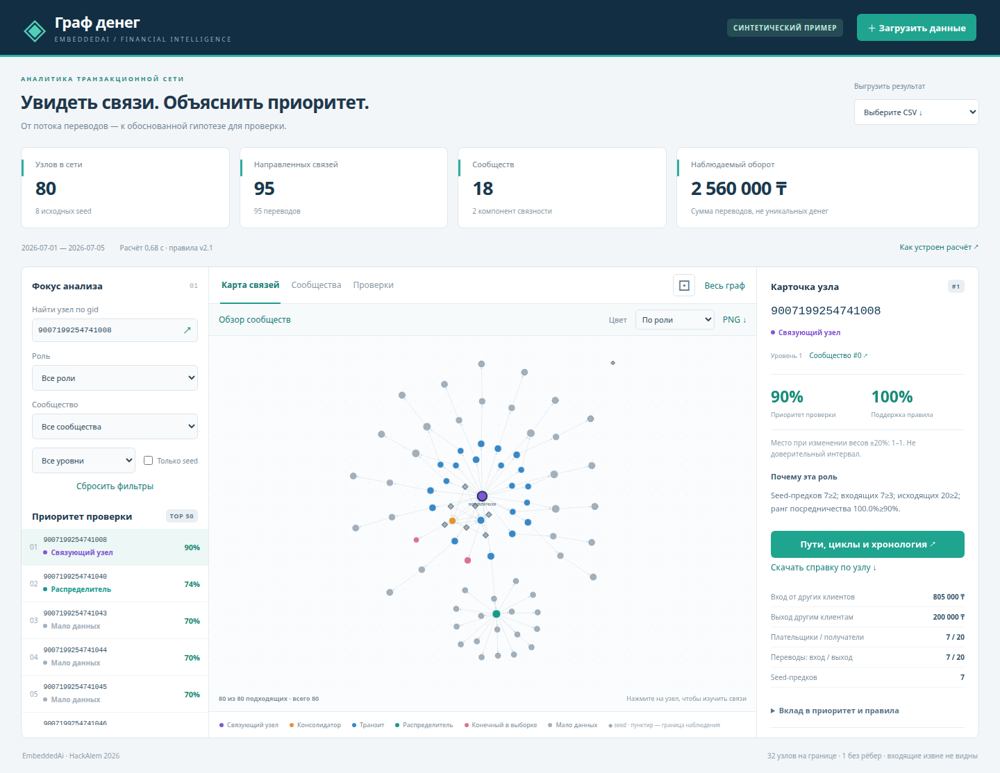
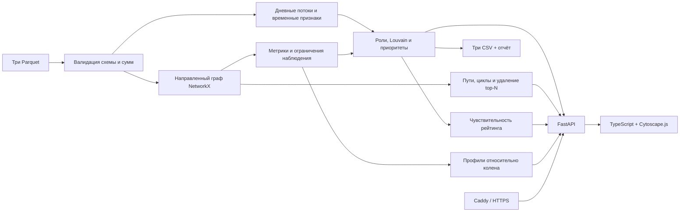

# Граф денег · EmbeddedAi

Инструмент для AML-аналитика: восстанавливает наблюдаемую структуру сети переводов,
объясняет роли узлов и помогает выбрать приоритеты дальнейшей проверки.
Версия приложения — **0.5.0**, правила — **2.2**.

**Демо:** https://cca8f159.nip.io — открывается на явно обозначенном синтетическом
наборе. Для анализа официальных данных загрузите три Parquet-файла локально.
Роли — проверяемые гипотезы, а не утверждения о виновности.

## Для жюри: три файла на вход → три CSV на выход

В корне есть **[analyze.py](analyze.py)** — отдельный Python-скрипт. Он вызывает
тот же расчёт, что CLI и веб-интерфейс. **Node.js, браузер, API-ключи и сервер
для получения CSV не нужны.** В приватном репозитории уже есть официальный
набор `data/data/`.

**Единственная команда пайплайна для жюри** — из корня репозитория, одинаковая
на Windows, macOS и Linux:

```text
uv run --frozen --no-dev python analyze.py --data ./data/data --out ./artifacts
```

Команда сама создаёт окружение, устанавливает закреплённые зависимости,
читает исходные Parquet, рассчитывает результат, записывает и проверяет все
три CSV. Ручной подготовки данных, запуска сервера и отдельного экспорта нет.
Единственный предварительно необходимый инструмент — uv; Python 3.12 при
необходимости установит uv. При уже установленном окружении доступен полностью
офлайн-запуск, описанный в [RUNNING.md](docs/RUNNING.md).

Установите [uv](https://docs.astral.sh/uv/getting-started/installation/), если его нет:

**Linux / macOS, терминал:**

```sh
curl -LsSf https://astral.sh/uv/install.sh | sh
```

**Windows, PowerShell:**

```powershell
powershell -ExecutionPolicy ByPass -c "irm https://astral.sh/uv/install.ps1 | iex"
```

После установки откройте новый терминал, перейдите в корень клонированного
репозитория и выполните единственную команду пайплайна выше.

uv создаёт `.venv`, при необходимости загружает Python **3.12**, устанавливает
зависимости из `uv.lock` и запускает расчёт. Интернет нужен при первой установке;
после неё вычисления выполняются локально. На официальном наборе ожидаются
**2248 строк узлов, 88 сообществ и TOP 50**. Актуальные фактические проверки —
[VALIDATION_05.md](docs/VALIDATION_05.md). Сверка каждого пункта ТЗ —
[AUDIT_05.md](docs/AUDIT_05.md).

Можно передать три файла по отдельности, в том числе с другими именами и из
разных каталогов. Эта команда также одинакова для PowerShell, Bash и zsh:

```text
uv run --frozen --no-dev python analyze.py --nodes "data/data/nodes.parquet" --edges "data/data/edges.parquet" --transactions "data/data/transactions.parquet" --out "artifacts"
```

Используйте либо `--data`, либо все три аргумента файлов. Справка:

```text
uv run --frozen --no-dev python analyze.py --help
```

Обычный CLI сохранён: `uv run --frozen --no-dev money-graph analyze --data
./data/data --out ./artifacts`. После установки пакета доступны `money-graph`
и `python -m money_graph`. Пошаговые команды установки, вариант **без uv через
pip**, запуск на трёх ОС и разбор ошибок — **[RUNNING.md](docs/RUNNING.md)**.

| Файл | Обязательные поля |
|---|---|
| `nodes_roles.csv` | gid, role, role_score, cluster_id, priority_score, evidence |
| `clusters.csv` | cluster_id, n_nodes, n_seed, sum_kzt_internal, top_gids, hypothesis |
| `top_nodes.csv` | rank, gid, role, priority_score, why |

Дополнительно создаются `run_report.json` (параметры, SHA-256 источников и время)
и `result.json` (состояние для API). CSV записаны в UTF-8 с одинаковыми переносами
строк на всех ОС; int64 ID — точные десятичные строки. При чтении в Excel/pandas
задавайте для `gid` текстовый тип, чтобы потребитель не округлял идентификаторы.

Код завершения **0** и JSON `status: "success"` в stdout означают, что все три
CSV записаны и проверены: точный порядок колонок, число строк и заполненность.
JSON содержит `output_dir`, список `exports` с путями, схемами, количеством
строк и SHA-256, а также `total_runtime_seconds` до окончания проверки файлов.
Установка зависимостей не входит в это поле; отдельный внешний замер включает
запуск Python. Все численные результаты вычисляются заново по переданным файлам.
Для наборов меньше 20 узлов TOP содержит все доступные узлы без выдуманных строк.
Некорректные аргументы,
данные или пути дают **2**, диагностику в stderr и сохраняют прежнюю выгрузку.
`--out` допускает новую/пустую папку либо папку только с результатами приложения;
CLI защищает исходники и посторонние файлы от перезаписи. Исходный набор и
`artifacts/` предназначены для жюри в рамках хакатона, не для публичного размещения.

## Проверить расчёт без веб-зависимостей

```text
uv run --frozen python scripts/verify.py --backend-only
```

Команда устанавливает зафиксированные dev-зависимости, проверяет Python lint,
форматирование, типы и тесты, включая официальный контракт. Node.js и Chromium
для этой команды не требуются. Полная проверка с интерфейсом:

```text
uv run --frozen python scripts/verify.py
```

Полный вариант дополнительно требует **Node.js 22.12+** с npm, собирает frontend,
проверяет TypeScript/Biome, production API/CSV и браузерные сценарии Playwright.
На Linux библиотеки Chromium можно установить командой
`npm --prefix web exec -- playwright install --with-deps chromium` после `npm --prefix web ci`.
Подробности и диагностика — [RUNNING.md](docs/RUNNING.md).

**GitHub CI отключён по решению владельца**; автоматических запусков на push/PR
нет. Проверки выполняются командами выше локально. Сохранённая
[матрица ОС](.github/workflows/verify.yml) может быть включена вручную позже.
Подготовленные инструкции Windows/macOS не выдаются за выполненные тесты на
этих ОС; фактические проверки перечислены в [VALIDATION_05.md](docs/VALIDATION_05.md).

## Открыть веб-интерфейс

Установите [Node.js](https://nodejs.org/en/download) версии 22.12+ вместе с npm.
Из корня репозитория на Windows/macOS/Linux:

```text
uv run --frozen --no-dev python scripts/start.py --data ./data/data --port 3010
```

Откройте **http://127.0.0.1:3010**. Скрипт устанавливает зависимости из lockfiles,
собирает интерфейс и запускает приложение. Для синтетического примера опустите
`--data`. При последующих запусках уже собранного приложения достаточно:

```text
uv run --frozen --no-dev money-graph serve --data ./data/data --port 3010
```

Bash-обёртки `scripts/start.sh` и `scripts/verify.sh` сохранены для совместимости;
на Windows Bash не нужен. Порт меняется через `--port` или `PORT`. Все JS/CSS
включены в сборку; CDN, внешние шрифты и платные API не используются.

## Что можно проверить в интерфейсе

- Направленный граф со стрелками, точный поиск `gid`, фильтры и шесть ролей.
- Метрики, объяснение роли, поддержка правила до/после поправки наблюдаемости.
- PageRank, точное посредничество на официальном наборе, охват seed, Louvain.
- Учёт 444 узлов на границе, изолятов, неполного входа seed и самопереводов.
- Дневные потоки, сопоставление через 1–2 дня, пути от seed, циклы и звенья A→B→C.
- Необычные профили относительно того же колена: контрагенты и денежный объём,
  с численным порогом, размером группы сравнения и явным отказом при нехватке данных.
- 12 сценариев чувствительности весов; сравнение удаления top-N, degree и случайных узлов.
- Выгрузки CSV, справка узла с SHA-256 и экспорт графа в PNG.
- Светлая, тёмная и системная темы с сохранением выбора; граф и диаграммы следуют теме.
- Сохранение выбранного расчёта после обновления страницы и перезапуска сервиса.



[Посмотреть тёмную тему](docs/images/demo-dark.png).

Основной сценарий: загрузите три файла → откройте TOP → объясните роль через
факты → найдите произвольный `gid` → покажите связи/сообщество → скачайте CSV.
Кнопка «Пути, циклы и хронология» открывает свидетельства, вкладка «Проверки» —
чувствительность и удаление узлов. Подробнее: [демо](docs/DEMO.md),
[аудит каждого пункта ТЗ](docs/AUDIT_05.md), [проверки 0.5](docs/VALIDATION_05.md).
История проверок: [0.4](docs/VALIDATION_04.md), [0.3](docs/VALIDATION.md).

## Архитектура и технологии



Python 3.12, pandas, PyArrow, NumPy/SciPy, NetworkX, FastAPI, Uvicorn;
TypeScript, Cytoscape.js и Vite. CLI и API вызывают один `pipeline.analyze`.
Состояние хранится в каталогах запусков; база данных для данного объёма не нужна.
Вычисления выполняются на CPU. GPU, обучение нейросети и платные API не требуются.

`uv build --wheel` собирает самостоятельный Python-пакет для команд `demo` и
`analyze`. Правила включены в wheel: после установки расчёт работает вне checkout
без `--rules`. Исходные данные и собранный веб-интерфейс в wheel не включены.
Для веб-приложения используйте checkout и `scripts/start.py`.

## Объяснимые правила

Правила версии 2.2 находятся в [config/rules.json](config/rules.json).
Полные определения, формулы поддержки и ограничения:
[docs/METHODOLOGY.md](docs/METHODOLOGY.md).

| Роль | Условия кандидата |
|---|---|
| coordinator | ≥2 seed-предка, ≥3 плательщика, ≥2 получателя, посредничество в верхнем дециле положительных значений |
| distributor | ≥10 разных получателей и ≥10 исходящих переводов |
| transit | Не seed и не граница, вход и выход есть, отношение выхода к входу 0,8–1,2 |
| consolidator | Не seed и не граница, ≥3 плательщика, отношение выхода к входу ≤0,2 |
| terminal | Не seed и не граница, вход есть, наблюдаемого выхода нет |
| peripheral | Нет достаточной поддержки более конкретной роли |

При пересечении применяется порядок строк таблицы. Карточка сохраняет все
совпавшие правила. Имена ролей в CSV соответствуют ТЗ. «Связующий узел» в
интерфейсе соответствует `coordinator` и подчёркивает гипотетичность вывода.
Для каждого совпадения показаны поддержка до поправки, коэффициент наблюдаемости
и итог. Для seed/границы применяется множитель 0,7.

`role_score` — эвристическая поддержка правила. `priority_score` — относительный
приоритет проверки: 20% PageRank, 20% посредничество, 20% охват seed,
20% денежный объём max(вход, выход), по 10% входящих и исходящих контрагентов.
Все признаки нормируются относительно текущих данных: `P=(L+0.5*E)/M`,
где L — число меньших положительных значений, E — равных, M — размер группы.
Одинаковые значения получают 0.5 даже в малом наборе; нулевые признаки — 0.
Это разные показатели. Посредничество рассчитывается точно при ≤2 500 активных
узлах с внешними контрагентами; выше — по 128 активным исходным вершинам с seed=42. Самопереводы исключены из потоков между
контрагентами, метрик ролей, PageRank и временных признаков; исходный оборот
и рёбра сохраняют их, карточка показывает отдельно.

### Должны ли правила зависеть от размера набора?

Смысл ролей сохраняется: минимумы плательщиков/получателей и отношение потоков
не умножаются на N. Пересчитываются относительные ранги, метрики, сообщества и
состав очереди проверки. Роли не назначаются по квотам. Изоляты не переключают
режим расчёта посредничества и не расходуют случайные опоры; точность остановки
PageRank по сумме изменений фиксирована независимо от N.

Дополнительно необычные профили сравниваются только с активными узлами того же
колена: `x > Q3 + 3*IQR` для числа контрагентов и денежного объёма. Нужно ≥20
узлов в группе и IQR>0, иначе система объясняет отказ от оценки. Эти сигналы
не меняют роль или приоритет. Формулы и ограничения — [METHODOLOGY.md](docs/METHODOLOGY.md).

## Данные и ограничения

Официальный набор: 2 248 узлов, 3 119 рёбер, 4 840 транзакций за июль 2026;
исходные 81 seed; только исходящие внутрибанковские переводы ≥5 000 KZT на четыре уровня.

- На depth=4 без выхода дальнейшее движение неизвестно. Такие узлы не объявляются
  terminal по отсутствию рёбер; ограничение указано в evidence CSV и подробно в интерфейсе.
- Входящие из других источников не видны. Отношение потоков — не полный баланс;
  выход выше входа не является самостоятельным сигналом нарушения.
- Изоляты сохраняются как отдельные кластеры и получают нулевой структурный приоритет.
- Нет истинных меток ролей: accuracy и калиброванная вероятность не заявляются.
- Сообщества — структурные группы, не установленные преступные организации.
- Даты доступны с точностью до дня; система не утверждает, что конкретный входящий
  перевод профинансировал конкретный исходящий.
- Приоритет и роли чувствительны к порогам и границам выборки. Формулы — открытая
  эвристика 2.2, не валидированная банковская модель принятия решений.
- Граф по умолчанию показывает до 350 наиболее приоритетных подходящих узлов,
  с явным счётчиком. Есть полный обзор и отдельное окружение выбранного узла.
- Внешний LLM-чат и автоматические решения о блокировке счетов не реализованы.
- Расчёт ограничен 10 000 узлами, 50 000 рёбрами, 100 000 транзакциями;
  оценка распакованного объёма файла ≤128 МБ. Веб-загрузка дополнительно ограничена
  10 МиБ на файл. За раз выполняется один расчёт на процесс.
- `gid/src/dst` принимаются только как целые в диапазоне signed int64 и передаются
  в JSON строками. Лишние колонки не используются и не попадают в результат.
  Суммы — положительные конечные числа; общий оборот каждой таблицы сумм
  ограничен `(2^53−1)/100` KZT, около 90 трлн, для ограничения потери денежной точности.
  Сверка edges с transactions использует допуск 0,01 KZT без относительного допуска.
- Дата — календарный день: ISO `YYYY-MM-DD`, Parquet date или timestamp в полночь
  без часового пояса. Числовые даты, время внутри дня и timezone отклоняются;
  их нужно явно преобразовать перед загрузкой.
- Загруженные результаты доступны по непредсказуемому run_id. Ссылка является
  доступом к результату: не делитесь ей вне нужного круга. Это демонстрационный
  сервис без модели корпоративных пользователей и ролей; реальные банковские
  данные следует анализировать локально.
- Старые загрузки удаляются только после успешной новой загрузки: старше 24 часов или сверх
  последних 20. Начальный демонстрационный набор сохраняется.

При перезапуске начальный расчёт переиспользуется только при совпадении режима
(синтетика/`--data`) и полной конфигурации правил; для `--data` дополнительно
сверяются SHA-256 всех трёх файлов. Правила фиксируются при старте процесса.
После их изменения нужен перезапуск и новый расчёт; устаревшее состояние не
выдаётся за актуальное. Прежние CSV доступны по сохранённым ссылкам выгрузки
до истечения срока хранения.

## Настройки

Обязательных секретов нет. Пример переменных — [.env.example](.env.example).
Переменные передаются через окружение; автоматического чтения `.env` нет.

| Переменная / параметр | По умолчанию | Назначение |
|---|---|---|
| `PORT` / `--port` | 3000 | Порт приложения |
| `MONEY_GRAPH_STORAGE` | `var/runs` | Каталог результатов |
| `--data` у serve | Нет | Предзагрузить набор; без него создаётся синтетический |
| `--rules` у analyze | `config/rules.json` в checkout; встроенные правила в wheel | Альтернативный файл правил |

## Production build и деплой

```bash
uv sync --frozen --no-dev
npm --prefix web ci
npm --prefix web run build
uv run --frozen --no-dev money-graph serve --host 127.0.0.1 --port 3000
```

Для VPS используется [deploy/money-graph.service](deploy/money-graph.service).
Приложение находится в `/opt/money-graph`, результаты — `/var/lib/money-graph`.
Служба работает от пользователя `moneygraph`, с автозапуском и перезапуском при
ошибке. Caddy завершает HTTPS и проксирует на loopback. Подробности:
[deploy/README.md](deploy/README.md).

## Масштабирование за миллион узлов

Текущая веб-версия ограничена **10 000 узлами, 50 000 рёбрами и 100 000
транзакциями**. Это проверяемый предел демо; увеличение одного числа не делает
NetworkX и общий JSON подходящими для миллиона узлов. В ТЗ требуется описание
перехода к этому масштабу, не реализация полного промышленного контура.

План: пакетное чтение Parquet и агрегация на диске → плотные внутренние индексы
при сохранении исходных int64 ID → компактные CSR/CSC-графы → фоновые расчёты
и версионированные таблицы признаков → выдача ограниченного подграфа интерфейсу.
Правила ролей, ограничения наблюдаемости, точность сумм и происхождение каждого
признака сохраняются. Приближённые центральности требуют отдельной проверки
устойчивости TOP/ролей; нельзя незаметно заменить точную метрику оценкой.

Уже внесённые оптимизации, воспроизводимые замеры, оценки памяти и критерии
сохранения качества подробно описаны в **[SCALING.md](docs/SCALING.md)**.
SHA-256 исходников считается потоком без копирования всего файла в память.
Полный прогон на миллионе узлов этой версией не заявляется.

## Источники

[ТЗ кейса](https://docs.google.com/document/d/1JPLU-G6R25Ge2hVaY2J9cqvrx7FGExj87XKwJPaMz3o/preview),
архив организаторов и сопровождающие `data/README.md`, `data/starter/README.md`.
Базовые определения признаков и схема CSV опираются на предоставленный starter.
Внешнее обогащение клиентов не используется. Разработка выполнена с Codex.
