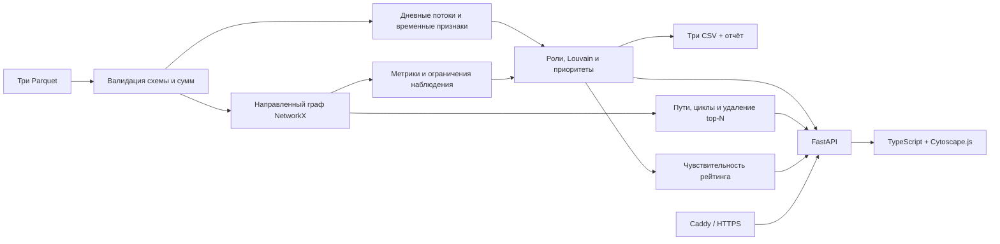

# Граф денег · EmbeddedAi

Инструмент для AML-аналитика: восстанавливает наблюдаемую структуру сети переводов,
объясняет роли узлов и помогает выбрать приоритеты дальнейшей проверки.
Версия приложения — **0.3.0**, правила — **2.1**.

**Демо:** https://cca8f159.nip.io — открывается на явно обозначенном синтетическом
наборе. Для анализа официальных данных загрузите три Parquet-файла локально.
Роли — проверяемые гипотезы, а не утверждения о виновности.

## Что реализовано

- Полный расчёт из `nodes.parquet`, `edges.parquet`, `transactions.parquet` в три CSV.
- Шесть ролей с формальными порогами, числовыми основаниями и поддержкой правила.
- Направленные метрики, PageRank, точное посредничество на официальном наборе, охват seed.
- Louvain-сообщества, приоритеты и топ-50 с объяснениями.
- Веб-интерфейс: загрузка, поиск точного `gid`, фильтры, граф со стрелками,
  карточка узла, соседи, просмотр сообществ и скачивание результатов.
- Учёт границы четвёртого уровня, неполного входа seed и изолированных узлов.
- Самопереводы показаны отдельно и не увеличивают потоки между клиентами или поддержку роли.
- Дневные потоки, синхронные поступления и сопоставление сумм через 1–2 дня без
  выдуманного внутридневного порядка.
- Проверяемые пути от seed, короткие циклы и повторяемые звенья A→B→C.
- Обзор связей между сообществами, окраска по сообществу или роли, суммы на рёбрах.
- Анализ чувствительности рейтинга: 12 сценариев изменения весов на ±20%.
- Моделирование удаления top-N: сравнение приоритета с degree и 20 случайными
  выборками; отделение потери связности от простого удаления вершин.
- Скачиваемая справка узла с фактами, ограничениями, следующими проверками и
  SHA-256 источников; экспорт изображения графа в PNG.
- Сохранение результатов после обновления страницы и перезапуска сервиса.
- Работа расчёта и интерфейса без внешних API и без доступа к интернету после установки.


## Быстрый запуск

Предварительно нужны **uv**, **Python 3.12** (uv может загрузить автоматически),
**Node.js 22.12+** и npm. Node.js нужен для сборки интерфейса; отдельный CLI-расчёт
работает без него. Интернет нужен для первой установки зависимостей.

Официальные файлы уже находятся в `data/data/` этого приватного репозитория.
После клонирования запустите из его корня:

```bash
./scripts/start.sh --data ./data/data --port 3010
```

Откройте **http://127.0.0.1:3010**. Приложение рассчитает официальный набор и
покажет граф, приоритеты и роли. Все JS/CSS включены в сборку; CDN и внешние
шрифты не используются. Исходные данные предоставлены исключительно для хакатона
и не входят в публичный релиз на VPS.

Для знакомства на синтетических данных запустите без `--data`:

```bash
./scripts/start.sh --port 3010
```

Скрипт устанавливает зависимости из lockfiles, собирает интерфейс и запускает
приложение. При последующих запусках установленного приложения достаточно:

```bash
uv run --frozen money-graph serve --data ./data/data --port 3010
```

Порт можно изменить через `--port` или `PORT`. На VPS приложение работает
на 127.0.0.1:3000 за Caddy.

## Воспроизвести расчёт одной командой

```bash
uv run --frozen money-graph analyze --data ./data/data --out ./artifacts
```

Команда использует официальный набор из checkout. Для другой выгрузки укажите
папку с тремя Parquet через `--data`. При отсутствии или повреждении файлов
команда завершается с понятной ошибкой и ненулевым кодом.
Алгоритм не содержит списков заранее выбранных `gid` и работает на других
наборах того же формата в пределах установленных лимитов.

`--out` должен указывать на новую/пустую папку или папку только с предыдущими
выгрузками приложения. CLI не заменяет исходные данные, рабочий каталог, файл
правил или посторонние файлы; предыдущие результаты сохраняются при ошибке
расчёта. Команда `money-graph demo --out <новая-папка>` создаёт синтетические
Parquet и также отказывается перезаписывать существующие файлы.

Выход:

| Файл | Содержимое |
|---|---|
| `nodes_roles.csv` | Все узлы: gid, role, role_score, cluster_id, priority_score, evidence (ровно 6 колонок) |
| `clusters.csv` | cluster_id, n_nodes, n_seed, sum_kzt_internal, top_gids, hypothesis |
| `top_nodes.csv` | rank, gid, role, priority_score, why; до 50 узлов, на официальном наборе 50 |
| `run_report.json` | Хеши исходных файлов, число узлов/рёбер, параметры правил, время расчёта |
| `result.json` | Состояние расчёта для API; служебный локальный файл |

Итоговые CSV официального набора находятся в `artifacts/` приватного репозитория
команды для проверки жюри. Не перепубликовывайте их вне условий хакатона.
`gid` в CSV записан точной десятичной строкой int64. При открытии в Excel или
pandas задавайте текстовый тип колонки, чтобы программа не округляла ID.

## Проверка решения

```bash
./scripts/verify.sh
```

Выполняются форматирование/lint Python и frontend в режиме проверки, mypy,
pytest, TypeScript, production-сборка, smoke-test приложения/API/CSV и браузерные
сценарии Playwright (поиск, доказательства, симуляция, загрузка, выгрузка, мобильный экран).
При первом прогоне скачивается Chromium; это зависимость тестов, не приложения.
Если на Linux не хватает системных библиотек браузера, установите их командой
`cd web && npx playwright install --with-deps chromium`, затем повторите проверку.
Тесты используют малые синтетические графы; на включённом в checkout `data/data/`
дополнительно проверяется официальный контракт: 2 248 узлов, 19 изолятов, 444 узла на границе,
не менее 20 приоритетов и расчёт быстрее пяти минут.

Пример проверки через интерфейс:

1. Нажмите «Загрузить данные», выберите три файла и выполните расчёт.
2. Откройте любой узел из «Приоритет проверки» — сравните evidence с метриками.
3. Вставьте полный `gid` в поиск — покажутся узел и его непосредственные связи.
4. Откройте «Сообщества» и перейдите к одному из кластеров.
5. Найдите узел на четвёртом уровне и прочитайте ограничение наблюдения.
6. Скачайте три CSV. В `nodes_roles.csv` должен быть каждый исходный `gid`.

Дополнительно откройте «Пути, циклы и хронология» в карточке узла и вкладку
«Проверки». Сравнение стратегий работает на текущем загруженном наборе, а не на
заранее подготовленных цифрах.

Подробный сценарий: [docs/DEMO.md](docs/DEMO.md).
Аудит требований и критериев: [docs/AUDIT.md](docs/AUDIT.md).
Результаты реально выполненных проверок: [docs/VALIDATION.md](docs/VALIDATION.md).

## Архитектура и технологии



Python 3.12, pandas, PyArrow, NumPy/SciPy, NetworkX, FastAPI, Uvicorn;
TypeScript, Cytoscape.js и Vite. CLI и API вызывают один `pipeline.analyze`.
Состояние хранится в каталогах запусков; база данных для данного объёма не нужна.
Вычисления выполняются на CPU. GPU, обучение нейросети и платные API не требуются.

`uv build --wheel` собирает самостоятельный Python-пакет для команд `demo` и
`analyze`. Правила включены в wheel: после установки расчёт работает вне checkout
без `--rules`. Исходные данные и собранный веб-интерфейс в wheel не включены.
Для веб-приложения используйте checkout и `scripts/start.sh`.

## Объяснимые правила

Правила версии 2.1 находятся в [config/rules.json](config/rules.json).
Полные определения, формулы поддержки и ограничения:
[docs/METHODOLOGY.md](docs/METHODOLOGY.md).

| Роль | Условия кандидата |
|---|---|
| coordinator | ≥2 seed-предка, ≥3 плательщика, ≥2 получателя, посредничество в верхнем дециле положительных значений |
| distributor | ≥10 разных получателей и ≥10 исходящих переводов |
| transit | Не seed и не граница, вход и выход есть, отношение выхода к входу 0,8–1,2 |
| consolidator | Не seed и не граница, ≥3 плательщика, отношение выхода к входу ≤0,2 |
| terminal | Не seed и не граница, вход есть, наблюдаемого выхода нет |
| peripheral | Нет достаточной поддержки более конкретной роли |

При пересечении применяется порядок строк таблицы. Карточка сохраняет все
совпавшие правила. Имена ролей в CSV соответствуют ТЗ. «Связующий узел» в
интерфейсе соответствует `coordinator` и подчёркивает гипотетичность вывода.
Для каждого совпадения показаны поддержка до поправки, коэффициент наблюдаемости
и итог. Для seed/границы применяется множитель 0,7.

`role_score` — эвристическая поддержка правила. `priority_score` — относительный
приоритет проверки: 20% PageRank, 20% посредничество, 20% охват seed,
20% денежный объём max(вход, выход), по 10% входящих и исходящих контрагентов.
Все признаки нормируются процентилями. Это разные показатели.
Посредничество рассчитывается точно при ≤2 500 узлах; выше — по 128 исходным
вершинам с фиксированным seed=42. Самопереводы исключены из потоков между
контрагентами, метрик ролей, PageRank и временных признаков; исходный оборот
и рёбра сохраняют их, карточка показывает отдельно.

## Данные и ограничения

Официальный набор: 2 248 узлов, 3 119 рёбер, 4 840 транзакций за июль 2026;
исходные 81 seed; только исходящие внутрибанковские переводы ≥5 000 KZT на четыре уровня.

- На depth=4 без выхода дальнейшее движение неизвестно. Такие узлы не объявляются
  terminal по отсутствию рёбер; ограничение указано в evidence CSV и подробно в интерфейсе.
- Входящие из других источников не видны. Отношение потоков — не полный баланс;
  выход выше входа не является самостоятельным сигналом нарушения.
- Изоляты сохраняются как отдельные кластеры и получают нулевой структурный приоритет.
- Нет истинных меток ролей: accuracy и калиброванная вероятность не заявляются.
- Сообщества — структурные группы, не установленные преступные организации.
- Даты доступны с точностью до дня; система не утверждает, что конкретный входящий
  перевод профинансировал конкретный исходящий.
- Приоритет и роли чувствительны к порогам и границам выборки. Формулы — открытая
  эвристика 2.1, не валидированная банковская модель принятия решений.
- Граф по умолчанию показывает до 350 наиболее приоритетных подходящих узлов,
  с явным счётчиком. Есть полный обзор и отдельное окружение выбранного узла.
- Внешний LLM-чат и автоматические решения о блокировке счетов не реализованы.
- Расчёт ограничен 10 000 узлами, 50 000 рёбрами, 100 000 транзакциями;
  оценка распакованного объёма файла ≤128 МБ. Веб-загрузка дополнительно ограничена
  10 МиБ на файл. За раз выполняется один расчёт на процесс.
- `gid/src/dst` принимаются только как целые в диапазоне signed int64 и передаются
  в JSON строками. Лишние колонки не используются и не попадают в результат.
  Суммы — положительные конечные числа; общий оборот каждой таблицы сумм
  ограничен `(2^53−1)/100` KZT, около 90 трлн, для ограничения потери денежной точности.
  Сверка edges с transactions использует допуск 0,01 KZT без относительного допуска.
- Дата — календарный день: ISO `YYYY-MM-DD`, Parquet date или timestamp в полночь
  без часового пояса. Числовые даты, время внутри дня и timezone отклоняются;
  их нужно явно преобразовать перед загрузкой.
- Загруженные результаты доступны по непредсказуемому run_id. Ссылка является
  доступом к результату: не делитесь ей вне нужного круга. Это демонстрационный
  сервис без модели корпоративных пользователей и ролей; реальные банковские
  данные следует анализировать локально.
- Старые загрузки удаляются только после успешной новой загрузки: старше 24 часов или сверх
  последних 20. Начальный демонстрационный набор сохраняется.

При перезапуске начальный расчёт переиспользуется только при совпадении режима
(синтетика/`--data`) и полной конфигурации правил; для `--data` дополнительно
сверяются SHA-256 всех трёх файлов. Правила фиксируются при старте процесса.
После их изменения нужен перезапуск и новый расчёт; устаревшее состояние не
выдаётся за актуальное. Прежние CSV доступны по сохранённым ссылкам выгрузки
до истечения срока хранения.

## Настройки

Обязательных секретов нет. Пример переменных — [.env.example](.env.example).
Переменные передаются через окружение; автоматического чтения `.env` нет.

| Переменная / параметр | По умолчанию | Назначение |
|---|---|---|
| `PORT` / `--port` | 3000 | Порт приложения |
| `MONEY_GRAPH_STORAGE` | `var/runs` | Каталог результатов |
| `--data` у serve | Нет | Предзагрузить набор; без него создаётся синтетический |
| `--rules` у analyze | `config/rules.json` в checkout; встроенные правила в wheel | Альтернативный файл правил |

## Production build и деплой

```bash
uv sync --frozen --no-dev
npm --prefix web ci
npm --prefix web run build
uv run --frozen --no-dev money-graph serve --host 127.0.0.1 --port 3000
```

Для VPS используется [deploy/money-graph.service](deploy/money-graph.service).
Приложение находится в `/opt/money-graph`, результаты — `/var/lib/money-graph`.
Служба работает от пользователя `moneygraph`, с автозапуском и перезапуском при
ошибке. Caddy завершает HTTPS и проксирует на loopback. Подробности:
[deploy/README.md](deploy/README.md).

## Масштабирование до миллиона узлов

Текущий NetworkX-граф в памяти и пересчёт на один запрос не рассчитаны на этот
масштаб. Понадобятся пакетная агрегация Parquet/колоночное хранение, igraph или
другой компактный графовый движок, фоновые задания, предрасчитанные признаки и
выборочные центральности. Для интерфейса — серверные подграфы, агрегация сообществ
и порционная выдача связей. Источники данных и версия алгоритма должны оставаться
привязанными к каждому результату; права доступа и аудит потребуют отдельного слоя.

## Источники

[ТЗ кейса](https://docs.google.com/document/d/1JPLU-G6R25Ge2hVaY2J9cqvrx7FGExj87XKwJPaMz3o/preview),
архив организаторов и сопровождающие `data/README.md`, `data/starter/README.md`.
Базовые определения признаков и схема CSV опираются на предоставленный starter.
Внешнее обогащение клиентов не используется. Разработка выполнена с Codex.
