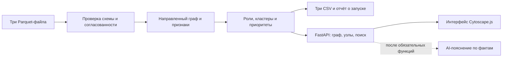

# План реализации кейса «Граф денег»

Дата: 23 сентября 2026. Команда EmbeddedAi.

Статус: обязательный сценарий реализован и развёрнут. Результаты проверок —
[VALIDATION.md](VALIDATION.md), актуальные команды — [README](../README.md).
Ниже сохранён исходный план v1 как исторический документ. Актуальная методика v2 —
[METHODOLOGY.md](METHODOLOGY.md), выполненный аудит и расширения — [AUDIT.md](AUDIT.md).
Добавлены временные признаки, пути/циклы, обзор сообществ, чувствительность и
моделирование удаления узлов; опциональный LLM не включён. Расписание рассчитано на пятичасовой бюджет разработки;
фактический остаток времени нужно сверить с дедлайном платформы.

## 1. Цель и критерий готовности

Аналитик загружает три Parquet-файла, получает объяснимое распределение ролей,
кластеры и приоритеты проверки, находит любой `gid` на схеме и выгружает три CSV.
Каждое решение можно объяснить через измеренные признаки и версию правил.
Выводы описывают признаки и гипотезы для проверки, а не виновность человека.

Обязательный расчёт работает локально без LLM, внешних данных и платных сервисов.
Опциональный AI помогает объяснять уже рассчитанные результаты.

| Требование ТЗ | Планируемый результат | Проверка приёмки |
|---|---|---|
| Один воспроизводимый запуск | CLI от исходных Parquet до трёх CSV | Запуск на чистом окружении с архивом организаторов; менее 300 секунд |
| Роль для каждого узла | `nodes_roles.csv`, включая узлы без рёбер | 2 248 уникальных строк на выданных данных, без пропущенных обязательных полей |
| Объяснимость | Формальные правила, пороги, признаки и короткое evidence | Для любого узла показать сработавшие условия и числа |
| Кластеризация | `cluster_id` у каждого узла и `clusters.csv` | Полное покрытие, правильные размеры, seed и суммы |
| Приоритеты и граф | `top_nodes.csv` с ≥20 узлами; интерактивная схема | Поиск произвольного `gid`, направления связей, роли, кластеры |
| Документация и демонстрация | README, диаграмма, ограничения и сценарий | Повторить запуск и за 5 минут разобрать 2–3 узла |

В общей оценке ТЗ соответствие задаче, техническая реализация и README дают
по 25 баллов. Ценность — 15, оригинальность — 10. Сначала закрываем обязательный
результат, затем добавляем отличительные возможности.

## 2. Что уже проверено в данных

Вход находится в `data/data/`; стартовый код — в `data/starter/`.
`data/ТЗ.txt` содержит ссылку на ТЗ, а не полный текст задания.

| Показатель | Фактический результат проверки |
|---|---|
| Узлы / рёбра / транзакции | 2 248 / 3 119 / 4 840 |
| Seed-клиенты | 81 |
| Период транзакций | 01.07.2026–31.07.2026 |
| Оборот по рёбрам | 365 890 012,01 KZT; это сумма переводов, не уникальных денег |
| Пропуски / дубли пар рёбер | Не обнаружены |
| Суммы и количество транзакций по парам | Совпадают с агрегированными рёбрами |
| Узлы без единого ребра | 19; все являются seed |
| Seed без исходящих | 31 |
| Граница обхода, depth=4 без исходящих | 444 |
| Слабосвязные компоненты | 35 с изолятами, 16 без них |
| Максимум плательщиков / получателей у узла | 24 / 116 |
| Безопасность `gid` для JavaScript Number | Не обеспечивается: есть числа больше `2^53−1` |

Временный диагностический прогон с чтением данных, построением графа,
PageRank, приближённым betweenness (`k=128`) и Louvain занял около 0,9 секунды.
Это не измерение будущего полного приложения и не гарантия его производительности.
Подробности и хеши файлов сохранены локально в `private/graph-data-audit.json`.

Starter использовать как основу загрузки и базовых признаков, исправив:

- граф должен начинаться с добавления **всех** `nodes.gid`, затем рёбер;
- проверять не только совпадение пар, но также суммы и количество транзакций;
- не переносить пустые роли, `cluster_id=-1` и фиктивные scores в готовый результат;
- включить SciPy в зависимости, если используется реализация PageRank NetworkX,
  которая его требует; проверить установку с чистого окружения.

## 3. Архитектура и стек

Предлагаемый стек: Python 3.12, pandas, PyArrow, NumPy, SciPy, NetworkX;
FastAPI + Uvicorn; TypeScript + Vite + Cytoscape.js для одного экрана аналитика.
Frontend собирается в статические файлы и отдаётся тем же Python-сервисом.
На первом этапе достаточно одного процесса, без отдельной базы данных и очереди задач.



Разделить вычислительную логику и интерфейс: CLI и HTTP вызывают один и тот же
pipeline. Расчёт не должен зависеть от браузера или ключа OpenAI.
Зафиксировать версии в `uv.lock` и `package-lock.json`. JS-библиотеки, шрифты
и стили поставляются локально; runtime-зависимостей от CDN нет.

Планируемая структура:

```text
src/money_graph/
  loader.py         # чтение и валидация
  features.py       # граф и числовые признаки
  roles.py          # формальные правила и evidence
  clustering.py     # сообщества и их показатели
  ranking.py        # приоритет и вклад признаков
  pipeline.py       # общий расчёт и экспорт
  cli.py            # команды analyze и serve
  api.py            # HTTP-контракты и загрузка
  schemas.py        # типы результатов и запросов
web/src/            # экран, граф, таблицы, карточка
config/rules.json    # пороги, веса, версия правил
tests/              # малые синтетические графы, API и контракты
scripts/            # запуск и единая проверка
deploy/             # systemd unit и инструкция
artifacts/          # финальные требуемые CSV для сдачи
docs/               # правила ролей, архитектура, ограничения
```

Это целевая организация, не требование создавать пустые файлы заранее.

## 4. Загрузка и целостность данных

1. Принимать ровно три именованных файла: nodes, edges, transactions.
2. Проверить обязательные столбцы, типы, уникальность `gid` и пар рёбер,
   ссылки на существующие узлы, допустимые depth, даты, конечность и знак сумм.
3. Сверить суммы и `n_tx` по каждой паре, а не только общий оборот.
4. Для сравнения денег использовать абсолютный допуск 0,01 KZT без относительного
   допуска либо согласованное округление в целые тиыны. Не округлять до тенге.
5. Узлы и суммы ожидаемого набора проверять в приёмочном тесте. Сам алгоритм
   должен работать на другом размере графа и не зашивать конкретные `gid`.
6. Сохранять отчёт: размер входа, хеши, период, предупреждения, версия правил,
   число кластеров и время выполнения по этапам.
7. При ошибке не публиковать частичные CSV и не заменять предыдущий успешный
   результат. Публиковать новый набор атомарно после проверки всех артефактов.

В Python сохранять `gid` как целые числа. В JSON, URL-параметрах и TypeScript
представлять идентификаторы десятичными **строками**. Не использовать `Number`,
`parseInt` или преобразование через float; отдельно протестировать round-trip.
CSV содержит точную десятичную запись исходного int64.

## 5. Метрики и ограничения наблюдения

Базовые признаки: входящие/исходящие суммы, число переводов, уникальных
контрагентов, depth, seed, PageRank с весом `sum_kzt`, компонент связности.

Дополнительные признаки для объяснимого ранжирования:

- число разных seed, из которых узел достижим по направлению рёбер за ≤4 шага;
  каждый seed учитывается один раз, сам узел не считается своим предком;
- приближённое посредничество на направленном графе с фиксированным seed=42,
  максимум 128 исходных вершин; использовать расстояние в переходах, а не сумму
  KZT как длину пути;
- количество связей с другими сообществами и доля межкластерного оборота;
- наблюдаемое отношение `out_kzt / in_kzt`, только при положительном входе;
- признаки неполноты: `boundary_censored`, `is_seed`, `inflow_unobserved`,
  `isolated`, `observed_out_exceeds_in`.

Отношение outgoing/incoming не является реальным балансом или временем удержания.
Для seed оно не используется как доказательство транзита/накопления. Значение >1
само по себе не считается аномалией: внешние поступления не видны.
Отсутствие исходящих у depth=4 не служит основанием для роли terminal.
Даже для depth<4 отсутствие исходящих означает только отсутствие **наблюдаемых**
переводов данного банка выше порога в данном периоде.

## 6. Роли: первая версия правил

Пороги ниже — стартовая гипотеза, которую проверяем на распределениях и
синтетических примерах; это не подтверждённые экспертами AML-правила.
Все пороги и веса находятся в одном конфиге и описаны в документации.

| Роль | Предлагаемое условие кандидата | Ограничение интерпретации |
|---|---|---|
| `coordinator` | ≥2 seed-предка, ≥3 входящих контрагента, ≥2 исходящих; посредничество ≥90-го процентиля положительных значений | Структурный кандидат на важную связующую роль, не доказанный организатор |
| `distributor` | ≥10 разных получателей, ≥10 исходящих переводов | Наблюдаемое веерное распределение, без требования полного входящего баланса |
| `transit` | Не seed и не граница; есть вход и выход; отношение 0,8–1,2 | Месячный баланс потоков не доказывает передачу тех же денег или скорость |
| `consolidator` | ≥3 плательщиков; для не-seed внутри границы отношение ≤0,2 | Признаки накопления только в пределах выборки |
| `terminal` | Не seed, depth<4, положительный вход, исходящих нет; правило consolidator не сработало | Наблюдаемый конечный узел периода, дальнейшие потоки неизвестны |
| `peripheral` | Нет достаточно выраженных признаков предыдущих ролей | Не означает безопасность; у изолятов и границы явно указываем недостаток данных |

На первом этапе пограничный узел, подходящий только под накопление/terminal,
получает `peripheral` с флагом неполноты и evidence о невозможности сделать вывод.
Его не исключаем из просмотра, кластеров или вычисления структурного приоритета.

Порядок разрешения пересечений фиксирован:
`coordinator → distributor → transit → consolidator → terminal → peripheral`.
В карточке показывать также все совпавшие правила: основная роль упрощает CSV,
но не должна скрывать неоднозначность.

`role_score` — нормированная сила поддержки выбранного правила, **не вероятность
виновности** и не калиброванная вероятность истинности роли. Рабочие формулы v1
ниже применяются только после выполнения условия кандидата из таблицы.
Обозначения: `S(x,t)=min(max(x/t,0),1)`, `P` — нормализация из следующего раздела,
`r=out_kzt/in_kzt`.

| Роль | Рабочая формула силы поддержки v1 |
|---|---|
| coordinator | `0.35*S(seed_reach,4) + 0.30*P(betweenness) + 0.20*S(in_deg,6) + 0.15*S(out_deg,5)` |
| distributor | `0.60*S(out_deg,20) + 0.25*P(out_tx) + 0.15*P(out_kzt)` |
| transit | `(1-abs(r-1)/0.4) * (0.5+0.5*S(min(in_tx,out_tx),3))` |
| consolidator | `0.50*S(in_deg,6) + 0.30*(1-min(r/0.2,1)) + 0.20*P(in_tx)` |
| terminal | `0.50 + 0.30*P(in_tx) + 0.20*S(in_deg,3)` |
| peripheral | `0`: нет достаточной поддержки более конкретной роли |

Для seed и границы дополнительно умножать поддержку на 0,7 с явной отметкой
ограниченной наблюдаемости; это условный коэффициент v1, не статистическая оценка.
Ограничить результат [0,1]. Проверить обычный случай, границы порогов и отсутствие
данных. Веса разрешается уточнить после анализа распределений, но не подбирать
под конкретные gid или заранее желаемое число ролей.

`evidence` формируется детерминированно из фактов, ≤200 символов, с числами:
например, «Вход от N плательщиков; выход X% наблюдаемого входа; depth=D».
LLM не генерирует обязательные evidence и не меняет рассчитанную роль.

## 7. Кластеры и приоритеты

Для Louvain создать отдельную неориентированную проекцию: вес A—B равен сумме
обоих направлений A→B и B→A. При этом основной граф остаётся направленным.
Использовать seed=42 и resolution=1.0; фиксировать порядок входа и версию NetworkX.
Изоляты оформить отдельными одноузловыми кластерами; они входят во все выгрузки.

Стабилизировать номера кластеров сортировкой по минимальному `gid` в сообществе.
Гипотезы о кластере строить из числа seed, состава ролей и наблюдаемых потоков,
не называть сообщества доказанными преступными группами.
Не подгонять число кластеров под число из примера организаторов.

Предлагаемая первая формула приоритета проверки:

```text
priority = 0.25 × P(pagerank)
         + 0.25 × P(betweenness)
         + 0.20 × P(seed_reach)
         + 0.15 × P(in_degree)
         + 0.15 × P(out_degree)
```

`P` — эмпирический процентиль среди положительных значений признака у
неизолированных узлов; одинаковым значениям — средний ранг, нулю — 0,
при отсутствии положительных значений — 0. Итог ограничить диапазоном [0,1].
Изолятам явно назначать priority=0: teleport-компонента PageRank не должна
создавать значимость при полном отсутствии связей.

Правила ранжирования общие для любых входов; в `why` показывать основные
вклады с исходными числами. При равенстве сортировать по `gid` как целому числу.
Приоритет проверки и уверенность в роли — разные показатели. Неполная роль
не означает, что структурно важный узел не требует внимания.

## 8. Выгрузки и API

- `nodes_roles.csv`: `gid, role, role_score, cluster_id, priority_score, evidence`.
  Допустимые дополнительные поля: исходные метрики и флаги неполноты.
- `clusters.csv`: `cluster_id, n_nodes, n_seed, sum_kzt_internal, top_gids, hypothesis`.
  Внутренний оборот считать по исходным направленным рёбрам ровно один раз;
  `top_gids` хранить как документированный список точных строковых ID.
- `top_nodes.csv`: `rank, gid, role, priority_score, why`; по умолчанию top-50,
  на малых тестах — все узлы. На официальном наборе должно быть не менее 20.
- `run_report.json`: диагностический дополнительный артефакт; обязательные
  CSV должны оставаться пригодными без него.

Предлагаемые HTTP-маршруты:

| Маршрут | Назначение |
|---|---|
| `GET /health` | Проверка процесса без LLM и тяжёлых вычислений |
| `POST /api/analyze` | Загрузка трёх файлов, валидация и расчёт |
| `GET /api/runs/{run_id}` | Размеры, статус, предупреждения и время расчёта |
| `GET /api/runs/{run_id}/graph` | Граф с фильтром по кластеру/узлу и ограничением объёма |
| `GET /api/runs/{run_id}/nodes/{gid}` | Метрики, правила, соседи и объяснение роли |
| `GET /api/runs/{run_id}/top` | Ранжированная таблица |
| `GET /api/runs/{run_id}/clusters` | Список кластеров |
| `GET /api/runs/{run_id}/exports/{name}` | Один из трёх разрешённых CSV |

С учётом малого набора первая версия может вернуть результат расчёта прямо из
POST, выполняя CPU-работу вне async event loop. Не вводить очередь до измерения.
Ограничить размер файлов, число параллельных расчётов и срок хранения временных
наборов. Не принимать файловые пути клиента; генерировать отдельный каталог
для каждого запуска. Имена выгрузок проверять по фиксированному списку.

## 9. Экран аналитика

Один основной экран с ясным маршрутом: загрузка → топ приоритетов → узел → связи.

- Верхняя полоса: набор данных, период, числа узлов/рёбер/seed, время расчёта,
  скачивание трёх файлов, предупреждения о неполноте.
- Слева: поиск `gid`, фильтры ролей, кластеров, глубины и seed, топ-20/50.
- В центре: направленный граф, цвет роли, выделение сообщества, легенда,
  масштабирование и возврат к обзору.
- Справа: карточка узла, метрики, объяснение правила, вклад в приоритет,
  предупреждения и таблицы входящих/исходящих связей.
- Отдельная вкладка того же экрана: таблица кластеров и гипотез.

По умолчанию показывать обзор сообществ или ограниченный подграф с явным числом
«показано X из Y». Поиск работает по всем узлам независимо от фильтра.
Переход к `gid` раскрывает его связи; для изолята видна одиночная вершина и
объяснение отсутствия рёбер. Полный граф доступен отдельным действием.
Подписи выводить у выбранных узлов; не запускать постоянную физическую раскладку
всех вершин после каждого клика. Глубину раскрытия ограничить 1–2 переходами.

Обязательные состояния: нет данных, загрузка/расчёт, успех, неверный файл,
неизвестный `gid`, пустой фильтр, ошибка сервера, недоступный AI.
Перезагрузка страницы должна сохранять доступ к текущему результату по run_id.

## 10. Этапы в пределах пяти часов

Время ниже — бюджет от начала реализации, не фактическое расписание мероприятия.
На сегодня подготовлены входные материалы и выполнен первичный аудит.

| Бюджет | Работа | Условие перехода |
|---|---|---|
| 00:00–00:20 | Зафиксировать контракты, правила v1, зависимости и проверки данных | Есть схема результатов и формулы; вход проходит валидацию |
| 00:20–01:30 | Pipeline: все узлы, признаки, роли, Louvain, ranking, три CSV | Полные непустые выгрузки, валидные диапазоны, повторяемость |
| 01:30–02:30 | API и минимальный интерфейс: загрузка, граф, поиск, карточка, top | Основной сценарий проходит через браузер |
| 02:30–03:00 | Первый деплой рабочего сценария на подготовленный VPS | HTTPS, загрузка и CSV работают; процесс переживает restart |
| 03:00–04:00 | Критические тесты, полные фильтры/кластеры, обработка ошибок | Все обязательные пункты покрыты; измерен полный пересчёт |
| 04:00–04:25 | Одна дополнительная функция, только если обязательная часть готова | Функция проверена, её отказ не ломает основной сценарий |
| 04:25–05:00 | README, диаграмма, чистый запуск, демо и сдача | Проверки зелёные, финальные файлы отправлены, форма сдачи заполнена |

Тесты вычислительных правил писать вместе с pipeline; отдельный час предназначен
для интеграционных проверок, UI и устранения дефектов. После готового основного
сценария сразу выполнять ранний деплой, не откладывать его до финального часа.

Если времени меньше: сохранить обязательные роли, кластеры, три CSV, поиск,
карточку и направленный граф. Сокращать сначала AI, временные паттерны,
анимации и дополнительные алгоритмы; не сокращать проверку целостности.
Если затянулась настройка VPS, локальная воспроизводимость остаётся обязательной;
отсутствие внешнего демо честно указывается, не маскируется фиктивной ссылкой.

## 11. Дополнительная ценность после обязательной части

Первый кандидат — карточка «что известно / чего не видно / что проверить»:
она использует уже имеющиеся флаги, хорошо объясняет ограничения выборки.

Следующий кандидат при наличии времени — AI-пояснение выбранного узла или
кластера. Сервер передаёт только рассчитанные метрики, подтверждённые связи,
сработавшие правила и ограничения. Ответ проверять на существующие ID;
не позволять модели придумывать атрибуты клиентов. Ограничить timeout,
размер контекста и запросы; при отсутствии ключа основной продукт работает.

Ключ не читать и не проверять в рамках составления плана. При реализации
интеграции загрузить его из серверного окружения, не из frontend и не из Git.
Для публичного демо ограничить платный endpoint, чтобы чужие запросы
не расходовали бюджет без контроля.

Более дорогие возможности — временные маршруты, циклы, удаление top-N узлов —
отложить. При анализе дат учитывать, что доступна дата без времени суток:
переводы в один день не доказывают последовательность или передачу тех же средств.

## 12. Проверки и воспроизводимость

Малые синтетические графы проверяют смысл алгоритмов независимо от официальных
данных: накопление, раздачу, транзит, связующий узел, пересечение правил,
изолят, границу depth=4 и seed с неполным входом.

Отдельные обязательные проверки:

- `gid` больше `2^53−1` не меняется в API, поиске, графе и CSV;
- все узлы из nodes включены, каждый имеет ровно один основной role и cluster;
- ни один узел depth=4 без исходящих не объявлен terminal по отсутствию выхода;
- суммы обратных рёбер при построении проекции корректно складываются;
- размеры кластеров дают общее число узлов, seed суммируются без потерь;
- evidence непустое, ≤200 символов; scores конечны и лежат в [0,1];
- экспорт не содержит `NaN` в обязательных полях и не теряет точность ID;
- повторный запуск с тем же входом/конфигом даёт те же CSV;
- повреждённый Parquet, отсутствующий столбец и расхождение сумм дают понятную
  ошибку; предыдущий успешный результат остаётся доступен;
- отключённый интернет/LLM не мешает расчёту и интерфейсу;
- приёмочный прогон официального набора: 2 248 строк, ≥20 приоритетов и <300 секунд.

Планируемые команды (создать при реализации; сейчас они ещё не существуют):

```bash
# Одна команда для установки, сборки и локального запуска при наличии uv и Node
./scripts/start.sh --data ./data/data --port 3000

# Отдельный воспроизводимый расчёт после установки зависимостей
uv run money-graph analyze --data ./data/data --out ./artifacts

# Единая проверка
./scripts/verify.sh
```

`verify.sh`: Python formatting/lint, типы, pytest; frontend formatting/lint,
`tsc --noEmit`, production build и проверка доступности собранной страницы/API.
Установка — из lockfiles. Браузерный smoke-test через Chrome DevTools:
загрузка → результат → произвольный `gid` → соседи → кластер → скачивание CSV.
Все проверки завершать реальным ненулевым кодом при ошибке.

Текущий `.gitignore` исключает `/data` и `AGENTS.md`. Не менять это молча.
Исходный архив предназначен для хакатона: в README точно описать получение
и расположение данных организаторов. В репозитории должны быть код, правила,
lockfiles и синтетические тестовые данные; финальные CSV предоставляются жюри
через разрешённый канал сдачи. Если они включаются в репозиторий команды,
проверить доступность репозитория и условия публикации исходного набора.
Без официального архива тесты на синтетических данных выполняются, а запуск
официального расчёта явно сообщает об отсутствующих файлах.

## 13. Деплой и финальная демонстрация

Цель: существующий Caddy проксирует `https://cca8f159.nip.io` на
`127.0.0.1:3000`. Перед работой сверить живое состояние VPS.

План деплоя: отдельный системный пользователь приложения, каталог релиза,
Python-окружение с фиксированной версией, собранные frontend-файлы, systemd unit,
`Restart=on-failure`, доступный для записи каталог результатов и журнал ошибок.
Приложение слушает loopback; Caddy остаётся единственным публичным входом.
`/health` проверяет процесс, отдельный smoke-test — данные и основной сценарий.
Секреты передаются через файл окружения вне web-root с ограниченными правами.
Docker не обязателен для данного способа деплоя.

Публичный демо-режим по умолчанию использует явно обозначенный синтетический
пример. Официальный набор анализируется локально либо в закрытом демо для жюри;
не размещать его в публичной статике только ради удобства демонстрации.

Сценарий пяти минут:

1. Кратко показать задачу и ограничения данных.
2. Загрузить официальный набор и выполнить расчёт.
3. Открыть top-list, разобрать два узла через числа и правила.
4. Найти произвольный `gid`, показать направления и связи.
5. Показать пограничный или изолированный узел и осторожность интерпретации.
6. Скачать CSV, показать команду воспроизведения и диаграмму.

README должен содержать реализованные функции, формулы, пороги, локальный запуск,
источники данных, ограничения, версии и время проверенного прогона, проверку,
деплой и раздел масштабирования. Для ~1 млн узлов описать переход к пакетной
агрегации/колоночному хранению, более эффективному графовому движку, выборочным
центральностям, предрасчёту и выдаче подграфов; реализация этого масштаба не нужна.

Перед сдачей: прогон всех пяти must-have, README без выдуманных результатов,
финальные CSV, диаграмма, `git status`, проверка секретов, commit/push в репозиторий
команды и заполнение формы «Сдать решение» на платформе.

## Источники

- [ТЗ кейса](https://docs.google.com/document/d/1JPLU-G6R25Ge2hVaY2J9cqvrx7FGExj87XKwJPaMz3o/preview).
- Локальные `data/README.md`, `data/starter/README.md`, `data/starter/starter.py`.
- Фактическая проверка трёх Parquet-файлов от 23.09.2026.
- [NetworkX: Louvain](https://networkx.org/documentation/stable/reference/algorithms/generated/networkx.algorithms.community.louvain.louvain_communities.html).
- [Cytoscape.js](https://js.cytoscape.org/).
- [FastAPI: раздача статических файлов](https://fastapi.tiangolo.com/tutorial/static-files/).
